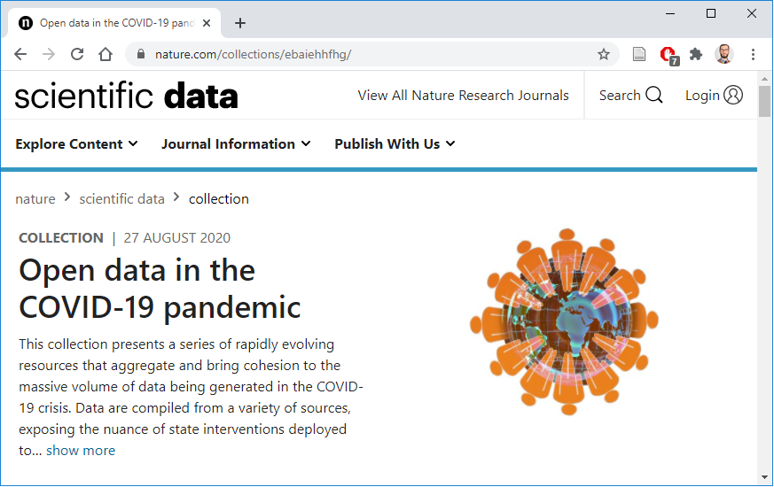
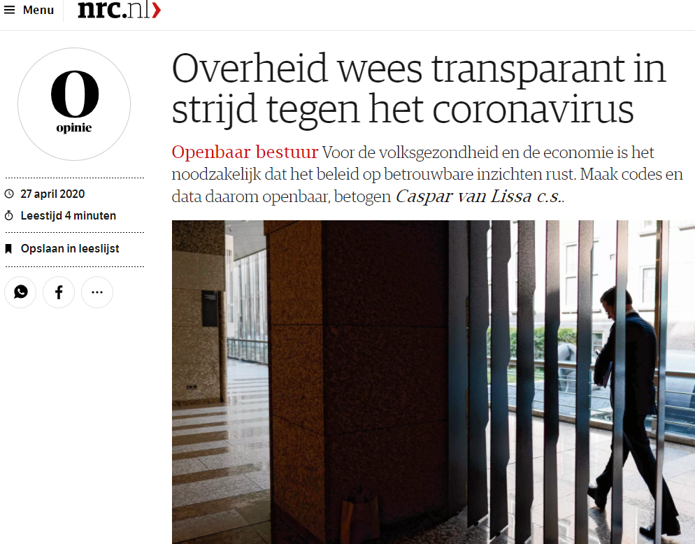
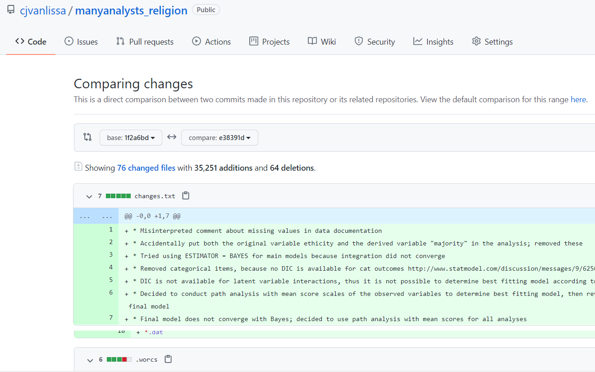
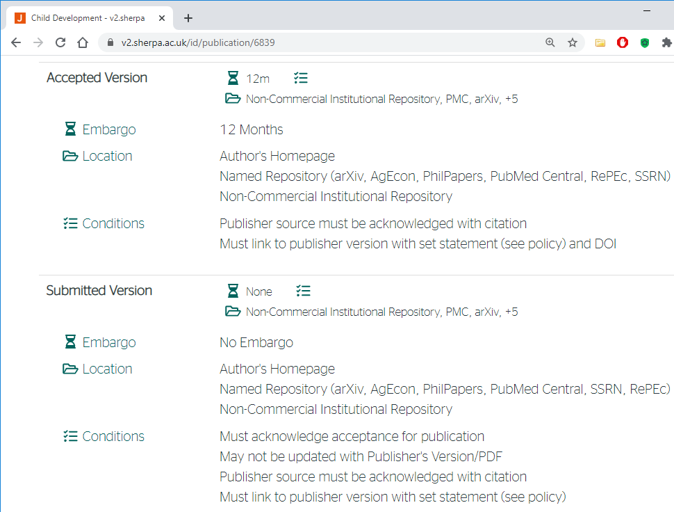

```{r setup, include=FALSE}
options(htmltools.dir.version = FALSE)
```

# Session goals

Start with round table, tell us who you are and what you hope to learn today!

1. Understanding why reproducibility increases reliability and trustworthiness of science
2. Experiencing how to make a research project open and reproducible using WORCS
3. Discussing specific challenges in your field
4. Making it personal: Sharing personal challenges and experiences of the attendees


---

# Defining Open Science

"Open science is just good science" (Jonathan Tennant, 2018)

* **Conceptually**, transparency / replicability are intrinsic to scientific method

Formal definitions:

* TOP guidelines (Nosek et al., 2015)
* FAIR principles (Wilkinson et al., 2016)
---

# Meeting TOP guidelines...

Relevant to openness and reproducibility:

1. **Citation** of literature, data, materials, and methods;
2. **Sharing** data;
3. **Sharing** the code required to reproduce analyses;
4. **Sharing** new research materials;
5. **Sharing** details of the design and analysis;
6. **Pre-registration** of studies before data collection;
7. **Pre-registration** of the analysis plan;

 Relevant to replication:

8. _Replication of published results._

.footnote[[Nosek _et al._, 2015](https://osf.io/9f6gx/#!)]
---

## ...in a FAIR manner

* **F**indable
    + Through standardized repositories or cross-repository search engines
    + With Digital Object Identifier (DOI)
* **A**ccessible online for humans and machines
    + Long-term storage
* **I**nteroperable
    + Open file type
* **R**eusability
    + License data, code, and materials for reuse

.footnote[Wilkinson et al., 2016]
---

# Why open science?

Sterling, 1959:


---

# Why open science?

* Scientific fraud (Levelt, Noort, & Drenth, 2012)
* Questionable research practices (John, Loewenstein, & Prelec, 2012)
* P-hacking / p-ritual (Gigerenzer, 2018)
* Replication crisis (Shrout & Rodgers, 2018)

#### So: Open science as punishment for bad science?
---

background-image: url("https://the-turing-way.netlify.app/_images/reproducibility.jpg")
background-size: 82% 82%

# Open science as a paradigm shift

#### Open Science creates opportunities to make science more
- reliable, 
- cumulative,
- collaborative, 
- inclusive

.footnote-bg[
(Artwork by Scriberia for [The Turing Way](https://the-turing-way.netlify.com/introduction/introduction), CC-BY)]

---

# When the stakes are high


---

# When the stakes are high


---

# When the stakes are high


---

# Open science as a challenge

#### Where do you start?

#### What tools do you need to learn?

#### What workflow is right for you?

---
# Introducing WORCS

### **W**orkflow for **O**pen **R**eproducible **C**ode in **S**cience
- Standardized workflow
- Low threshold, high ceiling
- Conceptual platform-independent principles: https://psyarxiv.com/k4wde
- "One-click" solution for R-users: https://cran.r-project.org/package=worcs
- Defaults based on best practices (several experts contributed)
- Compatible with journal/university requirements and other workflows
- Pulling down the learning curve!


---


# The tools

## 1. Dynamic document generation
## 2. Version control
## 3. Dependency management

---
background-image: url(https://rstudio.com/wp-content/uploads/2014/04/rmarkdown.png)
background-size: 20% 38%
background-position: right top

# 1. Dynamic document generation

- Paper consists of **text and code**
- Results, figures, and tables automatically generated
- Formatted as APA paper (including citations!)

### Important because:

- Save time from copy-pasting output and formatting paper
- Eliminate human error in copying results;
- When revising the paper, **all** results are automatically updated;
- Reproducible by default: Just generate the document


---
# R Markdown example


---
# R Markdown example rendered


---
# 2. Version control (using Git)

### Why version control?

.pull-left[

- NO MORE manuscript_final_final_SERIOUSLYFINAL.doc

- "Track Changes" on steroids: record entire project history

- If something breaks, you can figure out what happened.

- Facilitates collaboration and experimentation!

]

.pull-right[

]
---

# 2. Version control (using Git)

Tracks changes to (text-based) files line by line:

```{r, out.width="50%", echo = FALSE}
knitr::include_graphics("images/play-changes.svg")
```

* _add_ files to your repository
* _commit_ changes to these files
* _push_ all commits to remote repository (private backup or public online supplement)

```{r, out.width="50%", echo = FALSE}
knitr::include_graphics("images/git-staging-area.svg")
```

One command in `worcs`: `git_update("Describe your changes")`
.footnote-bg[
Image credit: [Software Carpentries](https://swcarpentry.github.io/git-novice/)
]

---
background-image: url(https://github.githubassets.com/images/modules/logos_page/Octocat.png)
background-size: 35% 40%
background-position: right top
# Introducing GitHub
.pull-left-larger[
- `worcs` repository is backed up in a remote repository like [GitHub](https://github.com/);

- GitHub is a **"cloud backup"** with **"social networking"** features
    + Clone other people's repository to reproduce or build upon them
    + Open Issues with questions or comments about the work
    + Send suggested changes as a "Pull request"

- GitHub can be used to 'tag' specific states of the repository, e.g. a preregistration.
]


---
# Important because:

- Complete backup of entire project history
    * Go back to previous version if you want
    * Try new things, don't worry about losing work
    * Prove that you preregistered your plans and followed them
- Easy collaboration online (even with strangers)
    * People can copy your project and build on it
- GitHub can be your preregistration, your research archive, supplementary materials, comments section, etc.
- Connects to OSF.io project page
    * Improves **F**indability
    * Get DOI for project and/or specific resources
- Connects to Zenodo
    * Get DOI for project and/or specific resources
    * Store project snapshot

---
# 3. Dependency management

- To make project reproducible, people must have access to your (exact) **software dependencies**
    * For R-users, these are `R-packages`

- Difficult trade-off:


---
background-image: url(https://rstudio.github.io/renv/reference/figures/logo.svg)
background-size: 20% 38%
background-position: right top
# Dependency management in WORCS

- Maintains text-based list of packages, their version,  
  and origin (e.g., “CRAN”, “Bioconductor”, “GitHub”)
- This list can be version-controlled with Git;
- When a user loads the project,  
    `renv` installs all dependencies from the list
    
### Important because:

- Essential for reproducibility
- Good for collaboration (everybody has same versions)
- Nice to your "future self": Your code will work in the future

<!-- With the background knowledge in mind, let's have another look at the workflow -->
---
# Unique features in `worcs`

* RStudio template
* Easy GitHub integration
    - Add URL during project creation
    - `git_update("Commit message")`
* Manuscript and preregistration templates
    - From `rticles`, `papaja`, and `prereg`
    - Original templates for secondary- and longitudinal data
* Solutions for data sharing
* Cite `@essential` and `@@nonessential`
* WORCS checklist and badge

---

# Sharing data in WORCS

- Reproducibility requires open data
- Some data may be (privacy) sensitive
    * E.g., children's data, veterans' data, patient data

#### Use `open_data()`:

- Original data made public
- Default is a `.csv` (text based, human / machine readable)
- Other save / load functions can be used

#### Use `closed_data()`:

- Original data saved locally;
- Synthetic data created using `synthetic()`
- Synthetic data made public (default: `.csv`)
- Unique ID of original data made public (so people can audit your work)
---


# Sharing data in WORCS

#### Loading data `load_data()`:

- **If** original data are present, load them...
- ...**Else**, load synthetic data
- Scripts can thus ALWAYS be reproduced
- People can create a working script using synthetic data, and send it to you to run on original data
- Load function recorded in `.worcs` file; default `read.csv()`

---

# Preregistration

> Specifying your research plan in advance of your study and submitting it to a registry.

**Goal:** Separating hypothesis-generating (exploratory) from hypothesis-testing (confirmatory) research. 

Subgoals:

* Planning tool
* Improve quality and transparency
* Clearly report your study
* Set boundaries for agreed-upon work (PhD student, statistical collaborator)

# Preregistration in WORCS

1. Complete a prereg template in Rmarkdown format `prereg.Rmd`
2. Commit and push to GitHub
3. Tag the release as `preregistration`
4. Optional: Render Rmarkdown to PDF and upload to OSF.io / aspredicted.org
5. Collect data
6. Write `manuscript.Rmd` with planned analyses
---

# Shortcomings of preregistrations

* Extra work
* Residual ambiguity
    + Unintentional
    + Strategic
* Straight-jacket: Can "force" researcher to stick with bad plans
* Researchers often not trained in preregistration
    + In neither writing nor reviewing thereof
* Not all preregistration templates are relevant for all research (e.g., secondary analysis)
* Difficult to compare with final manuscript, because they are in different formats
---


# Solution: PAC

1. Preregister Rmarkdown with draft of manuscript
2. Include code for planned analyses
3. Use synthetic data to obtain mock results
4. Draft report based on mock results

After collecting real data

5. Re-compile Rmarkdown and see final results
6. Write Results and Discussion

---

# Advantages

* Less work
    + You're not writing a separate document, but an early version of the final manuscript
    + You need to write code to analyze the data anyway
* unambiguous
    + Unintentional ambiguity ↓: You become aware of ambiguity in your planned analysis when you start actually running it 
    + Strategic ambiguity ↓: there's a straightforward game plan
* No Straight-jacket: Can't "force" researcher to stick with bad plans
    + You can deviate from planned analyses; create a Git commit with the changes
---

# Advantages 2

* Researchers are trained in writing papers, not preregistrations! Sticking with that format is easier to write and review
* Writing a preregistration as draft manuscript ensures all sections are directly relevant
* You can literally compare the two versions (using Git diff) to see how the planned analyses were executed

---
    
# Example

{width=90%}

---

# Limitations

* Can't cover all contingencies; deviations will be necessary
    + Version control makes clear what has changed
* Simulating data is difficult/requires much effort
    + But super useful, e.g. power analysis
    + Statistical co-author
    + Collect data first, shuffle dependent variable
* Requires reproducible/reusable workflow
    + But this ensures correctness/reliability/reusability of your work
* Preregistration forms may be more detailed / complement information in manuscript
    + What can we learn from prereg forms to improve our manuscripts?

---

# For non-R-users

* WORCS-paper addresses the **conceptual** workflow
* Covers issues/decisions you have to consider for Open Science, regardless of software
* We are looking for a collaborator to implement the workflow for `python` / `jupyter`

* WORCS is a good starting point for new R-users
    + We have a Setup Tutorial to make sure you correctly install R etc.
    + Tricky issues (like project management and using Git) are ~automatic when using the WORCS template
* Learn good habits from the start; don't reinvent the wheel
    
  

---


class:inverse, clear
background-image: url(https://raw.githubusercontent.com/cjvanlissa/worcs/master/paper/workflow_graph/workflow.png)
background-size: contain

---

class: center, inverse, middle
# Find out more:

<div style="background-color:#ffffff; text-align:center; vertical-align: middle; padding:20px 47px;"> <a href="http://developmentaldatascience.org/worcs">developmentaldatascience.org/worcs</a> </div>
---

# Open Science in Child Development

["(SRCD) regards scientific integrity, transparency, and openness as essential for the conduct of research and its application to practice and policy"](https://www.srcd.org/policy-scientific-integrity-transparency-and-openness)

* Scientific integrity includes core values of openness, objectivity, fairness, honesty, accountability and stewardship

* Transparency: clear, accurate, and complete reporting of all components of scientific research

* Openness: sharing of scientific resources (methods, measures, and data)

* Minimize potential harm to contributing participants, researchers, and the public
    + Children's data are often highly privacy sensitive
    + *<div style="color:#ff0000">"need to protect researchers from professional harm that can occur when requests for scientific transparency and openness veer into attacks on the integrity of researchers themselves"</div>*
---

# Open Science and APA

[](https://www.apa.org/pubs/journals/resources/open-science)

---


# Developmental research: data

*	Children’s data are often privacy sensitive
    + Grounds to eschew all open science practices?
    + WORCS can create synthetic data (`closed_data()` or `synthetic()`)
    + Computational reproducibility can be verified
    + Unique ID for original data so analysis can be audited
* Data are a valuable commodity; researchers should control access
    + Restricted access / conditional access is possible
    + Who owns the rights to data?
    + What are university / funder requirements regarding open data?
---

# Developmental research: Preregistration

Weston et al., 2019

* Secondary data underemphasized in open science
* Analysis can be either exploratory or confirmatory 
* Strong risk (and incentives) for undisclosed exploration and HARKing
    + Leads to spurious / unreliable findings
* Transparency improves reliability of results

Solutions:

* Registering analyses before data are accessed / analyzed
* Disclose prior (indirect) exposure
* Use cross-validation / holdout samples
* Sensitivity analyses (what happens to results if...)
---

# Preregistration templates

`worcs::add_preregistration("Secondary")`

> Mertens, G., & Krypotos, A. M. (2019). Preregistration of analyses of
preexisting data. Psychologica Belgica, 59(1), 338-352. doi: 10.5334/pb.493

`worcs::add_preregistration("PSS")`

> Krypotos, A. M., Klugkist, I., Mertens, G., & Engelhard, I. M. (2019).
A step-by-step guide on preregistration and effective data sharing for
psychopathology research. Journal of Abnormal Psychology, 128(6), 517-537.
https://psycnet.apa.org/doi/10.1037/abn0000424
---

# Perspective from the Editor

Child Development Editor-in-Chief prof. dr. Glenn Roisman:

* Move to a policy more consistent with the APA ethics code
    + Condition acceptance on availability of data, code, or materials post-publication
    + Supporting diversity and inclusion (not creating unfair burdens for lower resourced scientists)
* Incentivization [through] P&T/hiring decisions (outcomes with real life consequences)
* Open science has a lot of fronts/distinct initiatives, which makes adoption by journals uneven 
    + CD is focusing on pre-reg and RRs
    + open reviews and open journals?
* Few journal resources to check final reports against pre-registrations, even when these exist
---

# CD open access / preprints

* Open access fee ~3300 USD 
* Preprint allowed [(check Sherpa Romeo)](https://v2.sherpa.ac.uk/romeo/)
    + https://psyarxiv.com/
    + https://osf.io

```{r, out.width = "70%", echo = FALSE}

```
---

# JRA open access / preprints

* Open access fee 3,150 USD
* Submitted version can be posted as preprint [(check Sherpa Romeo)](https://v2.sherpa.ac.uk/romeo/)
    + https://psyarxiv.com/
    + https://osf.io
* More info: https://onlinelibrary.wiley.com/page/journal/15327795/homepage/fundedaccess.html
---

# JRA Mission

"Redefining Possibilities and Amplifying Marginalized Voices"

<!-- * Open science opens up new possibilities for transparency -->
<!-- * Increases the reliability of findings -->
<!-- * Public trust in science -->

* Access to secondary data sources for those not able to collect their own data
* Free (high-quality) post-graduate education; specialize in data analysis and...
* ...collaborate with progressive like-minded scholars around the world
* Alternative pathways to publication instead/alongside of paywalled outlets
* Marginalized researchers can participate and be informed about the scientific process on equal footing, regardless of structural (dis-)advantages
* Marginalized communities can access scientific knowledge and use it to the benefit of the community, or to strengthen political causes
* Citizen science aspect of open science empowers marginalized communities to co-create research (as also illustrated by the involvement of adolescents in the 2022 SRA conference)
---

# Resources

* Papers on open science workflows
    + WORCS: A workflow for open reproducible code in science: doi.org/10.3233/DS-210031
    + Reproducible Research in R: A Tutorial on How to Do the Same Thing More Than Once doi.org/10.3390/psych3040053
* Community building
    + https://www.startyourosc.com
* Tutorial videos:
    + http://developmentaldatascience.org/worcs
---