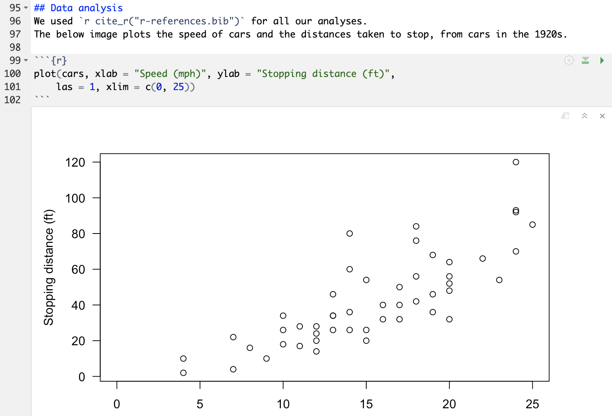
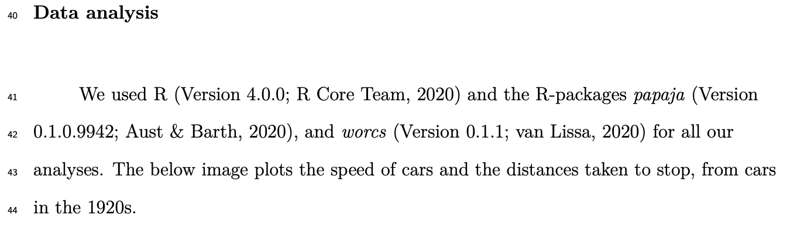
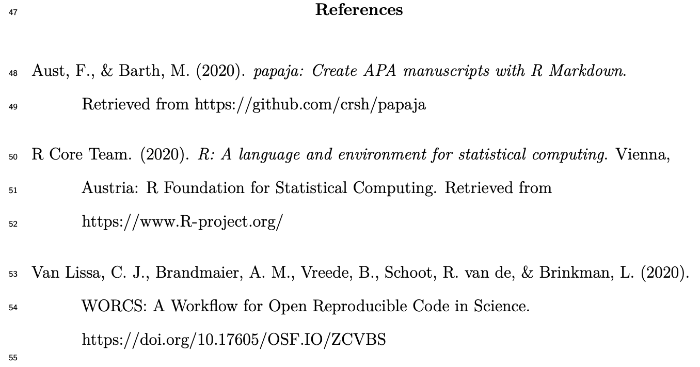
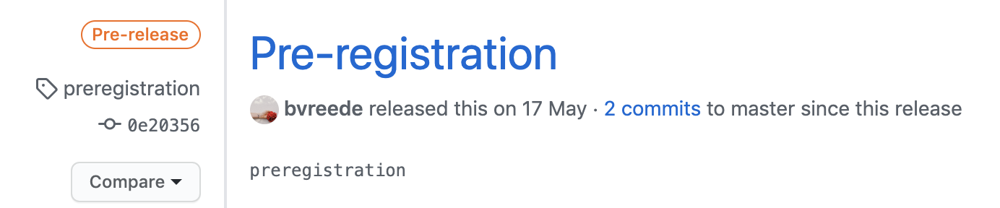

background-image: url("https://the-turing-way.netlify.app/_images/reproducibility.jpg")
background-size: 82% 82%

```{r setup, include=FALSE}
options(htmltools.dir.version = FALSE)
```

<!-- Here, introduce the general principles of open science and the motivation for worcs -->

# Open science as a paradigm shift

#### Open Science creates opportunities to make science
- more reliable, 
- more collaborative, 
- more inclusive,
- more...

.footnote-bg[
(Artwork by Scriberia for [The Turing Way](https://the-turing-way.netlify.com/introduction/introduction), CC-BY)]

---
# Open science as a challenge?

It is a motivating goal, but often requires new familiarities and skills:
- new platforms
- new attributes
- new tools
- new...

<!-- Here, introduce the standards to strive for -->
--

#### TOP guidelines for Open Science: comprehensive, yet broad standards

1. **Citation** of literature, data, materials, and methods;
1. **Sharing** data;
1. **Sharing** the code required to reproduce analyses;
1. **Sharing** new research materials;
1. **Sharing** details of the design and analysis;
1. **Pre-registration** of studies before data collection;
1. **Pre-registration** of the analysis plan;
1. **Replication** of published results.

.footnote[[Nosek _et al._, 2015](https://osf.io/9f6gx/#!)]

---
# Introducing WORCS

### A **W**orkflow for **O**pen **R**eproducible **C**ode in **S**cience
- YES to open
- YES to reproducible
- YES to best practices...

--

### But attainable!

--


.footnote[Pulling down the learning curve!]
---
# Facilitates meeting TOP guidelines

1. **Citation** of literature, data, materials, and methods;
1. **Sharing** data;
1. **Sharing** the code required to reproduce analyses;
1. **Sharing** new research materials;
1. **Sharing** details of the design and analysis;
1. **Pre-registration** of studies before data collection;
1. **Pre-registration** of the analysis plan;
1. _Replication of published results._

## ...in a FAIR manner

* **F**indable data etc.
* **A**ccessible online for humans and machines
* **I**nteroperable: Everything in an easy-to-adapt format
* **R**eusability; people can use your data, your code, your materials in cloned projects

<!-- Here, give a conceptual platform-independent outline of WORCS.
This requires some thought; for now, just foreshadow the worcs infograph
to give attendees some idea of what practical issues we address.
No detail at this stage -->

---
class:inverse, clear
background-image: url(https://raw.githubusercontent.com/cjvanlissa/worcs/master/paper/workflow_graph/workflow.png)
background-size: contain

<!-- Discuss the R implementation in the `worcs` package -->
---
background-image: url(images/worcs_badge.png)
background-size: 30% 40%
background-position: right top
# WORCS in practice

- Implemented for R (Studio) users in an R package [`worcs`](https://github.com/cjvanlissa/worcs)

--

- Lightweight, flexible, streamlined
  
--

- Facilitates:
  - Comprehensive citation
  - Pre-registration
  - Sharing (synthetic) data
  - Pre-print submission

--
  
- Works with best (coding) practices:
  - Dynamic document generation
  - Version control with git
  - Dependency management

---
background-image: url(images/worcs_viz.png)
background-size: contain
# Conceptual overview of a `worcs` project

---
# The tools

1. Dynamic document generation
1. Version control
1. Dependency management

---
background-image: url(https://rstudio.com/wp-content/uploads/2014/04/rmarkdown.png)
background-size: 20% 38%
background-position: right top

# Dynamic document generation

- Combining narrative with code

- Automatically generates figures and tables

- Automatically renders results in text

- Formatting into scientific paper (including citations!)


#### Implementation in `worcs`
- `R Markdown`  
  _a commonly used package that combines text in Markdown with code in R_
- `papaja` (Preparing APA Journal Articles)  
  _an R package that helps produce complete APA manuscripts from R Markdown-files._
- `rticles`  
  _Other common journal formats, primarily from the sciences._

---
# R Markdown



---
# Citation in Markdown

`cite_r("r-references.bib")` (a `papaja` function) cites all packages used:




---
# Citation in Markdown 2

* Cite references using `@` symbol
* Keep a `.bib` file with "bibtex" citations
  + You can export this from [Zotero](https://www.zotero.org/) or other (worse) reference managers
* `worcs` adds a `@@` symbol for optional citations


---
# Return on investment?

### User needs to spend time learning:

- Markdown language itself;
- All analyses and plotting in R.

--

### But this is time well spent:

- No more painstakingly copy-pasting output and manually formatting text;
- Eliminate human error in manually copying results is eliminated;
- With (major) revisions, all results are automatically updated;
- Integration of reproducibility: reviewers/readers can easily verify the results by re-compiling the document.


---
# Version control

### Why version control?

.pull-left[

- Like Track Changes on steroids: manages history of (even experimentation with) ~~your code~~ most of your files

- It allows you to trace back your steps: if something breaks, you can figure out what happened.

- NO MORE manuscript_final_final_SERIOUSLYFINAL.doc

- Facilitates collaboration and experimentation!

]

.pull-right[

]
---
# Version control with Git
### What is git?

.pull-left[
- Distributed Version Control system written by Linus Torvalds (of Linux fame);

- Allows you to log updates, and keep all backups, while efficiently using your storage;

- Gives user a lot of control on what to track, and adds a narrative to changes ('commit comments')

- Easily used from within RStudio;

- Facilitates experimentation with 'branches', so you can experiment without losing the original (advanced use).
]

.pull-right[

]


---
# How does Git work?

Tracks differences in (text-based) files line by line:


--

Step-wise saving to the _repository_, using narrative _commit_:


.footnote-bg[
Image credit: [Software Carpentries](https://swcarpentry.github.io/git-novice/)
]

---
background-image: url(https://github.githubassets.com/images/modules/logos_page/Octocat.png)
background-size: 35% 40%
background-position: right top
# From local to remote
.pull-left-larger[
- `worcs` repository is pushed to [GitHub](https://github.com/) (or another hosting service);

- GitHub performs as an online backup initially...

- ... but can become a sharing platform when the repository is set to "public";

- GitHub can be used to 'tag' specific states of the repository, e.g. a preregistration.
]



---
# The gist about GitHub

Cross-over between cloud hosting and social media

Cool things:

* Your entire project is hosted here
* Can be public
* People can open *Issues* or send fixes to code using *Pull requests*
* People can *Clone* your project to check if it is reproducible, or use it as a starting point for their follow-up study
* Great for organizing collaboration
* Great place to find progressive collaborators


---
# User investment

### User needs to spend time learning:

- Rstudio Git interface and/or `worcs` Git functions;
- A habit of committing the project often and descriptively;
- Their way around the GitHub platform.

--

### Most Git-related actions are streamlined
- Vignette guides user through basic set-up;
- `worcs::git_update()` performs add, commit, and push of all changed files in one step;
- Rstudio Git interface is friendly and visual.

---
# Dependency management

- Ensure that the code can be sustainably reproduced...

- ...despite changes in packages and other software used in the analysis ('dependencies').

--

- Can be a challenging part of writing reproducible code!


--

### What is due diligence?

---
# _A note on dependencies_

#### `worcs` itself has been written with a dependency-light philosophy.

It does not use gratuitous packages!

Instead, dependencies are carefully chosen: excellently performing implementations of __key elements__ in an open and reproducible workflow.


---
background-image: url(https://rstudio.github.io/renv/reference/figures/logo.svg)
background-size: 20% 38%
background-position: right top
# Dependency management in WORCS

- `renv`, by Kevin Ushey at RStudio

- maintains a text-based, human-readable log of:
  - all packages
  - their version number
  - their source (e.g., “CRAN”, “Bioconductor”, “GitHub”)
  
- Lightweight solution, which can itself be version-controlled with Git;

- When a user loads the project, `renv` installs its dependencies.

#### Note:
Sustainable archiving of dependencies at their respective sources is required!

<!-- With the background knowledge in mind, let's have another look at the workflow -->
---
class:inverse, clear
background-image: url(https://raw.githubusercontent.com/cjvanlissa/worcs/master/paper/workflow_graph/workflow.png)
background-size: contain


---
# (FAIR) Data in WORCS

- `worcs` contains a dedicated script for data preparation (`prepare_data.R`)
- Aimed at generating a clean `.csv` for analysis.

#### If the script ends with `open_data()`:
- Clean `.csv` file of the data is added to the repository and tracked by Git.

#### If the script ends with `closed_data()`:
- A clean `.csv` file of the data is saved locally;
- A simulated dataset is added to the repository and tracked by Git.

#### Always
- A codebook of the data is created and tracked by Git.

---
# Sharing data safely

- ONLY the cleaned (syntetic) data is tracked by Git, and stored on GitHub!

- Other `.xlsx`, `.csv`, `.sav` files are ignored by Git.

- An explicit choice for `open_data()` or `closed_data()` is needed, before the data is recorded at all!

- Reading the data in a `worcs` project is done with `load_data()`:
  - If the original `data.csv` is present, this file is read (on the author's system)
  - If a user copied the repository, `synthetic_data.csv` is read instead.

---
# Open Science Framework (OSF)

- The WORCS workflow invites [connecting the GitHub repository to OSF](https://help.osf.io/hc/en-us/articles/360019929813-Connect-GitHub-to-a-Project), streamlining the archiving of a project

- A manuscript, once rendered, can be uploaded directly as a pre-print.


---
class: center, inverse, middle

# Thank you!


