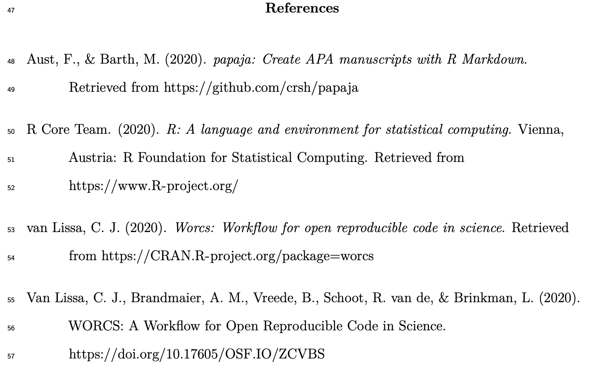

background-image: url("https://the-turing-way.netlify.app/_images/reproducibility.jpg")
background-size: 82% 82%

```{r setup, include=FALSE}
options(htmltools.dir.version = FALSE)
```

<!-- Here, introduce the general principles of open science and the motivation for worcs -->

# Open science as a paradigm shift

#### Open Science creates opportunities to make science
- more reliable, 
- more collaborative, 
- more inclusive

.footnote-bg[
(Artwork by Scriberia for [The Turing Way](https://the-turing-way.netlify.com/introduction/introduction), CC-BY)]

---
# Open science as a challenge

#### Where do you start?

#### What tools do you need to learn?

#### What workflow is right for you?

---
# Introducing WORCS

### **W**orkflow for **O**pen **R**eproducible **C**ode in **S**cience
- A standardized workflow
    * Conceptual & platform-independent, https://psyarxiv.com/k4wde
- A "one-click" solution for R users, https://cran.r-project.org/package=worcs
- Based on best practices (several experts contributed)
- Compatible with existing requirements and other workflows
- Pulling down the learning curve!


---
# Based on the TOP guidelines

1. **Citation** of literature, data, materials, and methods;
1. **Sharing** data;
1. **Sharing** the code required to reproduce analyses;
1. **Sharing** new research materials;
1. **Sharing** details of the design and analysis;
1. **Pre-registration** of studies before data collection;
1. **Pre-registration** of the analysis plan;
1. _Replication of published results._

.footnote[[Nosek _et al._, 2015](https://osf.io/9f6gx/#!)]

<!-- Here, give a conceptual platform-independent outline of WORCS.
This requires some thought; for now, just foreshadow the worcs infograph
to give attendees some idea of what practical issues we address.
No detail at this stage -->

<!-- --- -->
<!-- class:inverse, clear -->
<!-- background-image: url(https://raw.githubusercontent.com/cjvanlissa/worcs/master/paper/workflow_graph/workflow.png) -->
<!-- background-size: contain -->


---
# The tools

## 1. Dynamic document generation
## 2. Version control
## 3. Dependency management

---
background-image: url(https://rstudio.com/wp-content/uploads/2014/04/rmarkdown.png)
background-size: 20% 38%
background-position: right top

# 1. Dynamic document generation

- Paper consists of **text and code**
- Results, figures, and tables automatically generated
- Formatted as APA paper (including citations!)

### Important because:

- Save time from copy-pasting output and formatting paper
- Eliminate human error in copying results;
- When revising the paper, **all** results are automatically updated;
- Reproducible by default: Just generate the document


---
# R Markdown example


---
# R Markdown example rendered




---
# Sharing data in WORCS

- Reproducibility requires open data
- Adolescents' data may be (privacy) sensitive

#### Use `open_data()`:

- Original data made public as `.csv` file

#### Use `closed_data()`:

- Original data saved locally;
- Simulated data made public as `.csv` file
- A unique ID for the original data is made public (so people can check)

#### Loading data `load_data()`:
- Reads original `data.csv` if present
- Otherwise, reads `synthetic_data.csv`


---
# 2. Version control (using Git)

Tracks differences in (text-based) files line by line:


Save tracked changes to the _repository_, and _commit_ with a descriptive message:


.footnote-bg[
Image credit: [Software Carpentries](https://swcarpentry.github.io/git-novice/)
]

---
background-image: url(https://github.githubassets.com/images/modules/logos_page/Octocat.png)
background-size: 35% 40%
background-position: right top
# Introducing GitHub
.pull-left-larger[
- `worcs` repository is pushed to [GitHub](https://github.com/);

- GitHub is a "cloud backup"...

- ... as well as a "social network" platform;

- GitHub can be used to 'tag' specific states of the repository, e.g. a preregistration.
]


---
# Important because:

- Complete backup of entire project history
    * Go back to previous version if you want
    * Prove that you preregistered your plans and followed them
- Easy collaboration online (even with strangers)
    * People can copy your project and build on it
- GitHub can be your preregistration, your research archive, supplementary materials, comments section, etc.
- Connects to OSF.io project page

---
# 3. Dependency management

- To make project reproducible, people must have access to your (exact) **software dependencies**
    * For R-users, these are `R-packages`

- Difficult trade-off:


---
background-image: url(https://rstudio.github.io/renv/reference/figures/logo.svg)
background-size: 20% 38%
background-position: right top
# Dependency management in WORCS

- Maintains text-based list of packages, their version,  
  and origin (e.g., “CRAN”, “Bioconductor”, “GitHub”)
- This list can be version-controlled with Git;
- When a user loads the project,  
    `renv` installs all dependencies from the list
    
### Important because:

- Essential for reproducibility
- Good for collaboration (everybody has same versions)
- Your code is self-contained and will work in the future

<!-- With the background knowledge in mind, let's have another look at the workflow -->
---
class:inverse, clear
background-image: url(https://raw.githubusercontent.com/cjvanlissa/worcs/master/paper/workflow_graph/workflow.png)
background-size: contain

---
class: center, inverse, middle

# Find out more:

developmentaldatascience.org/worcs
